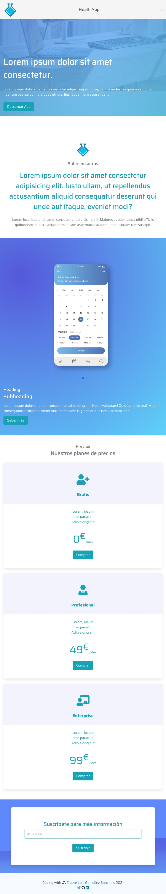

# Bulma - Health App

Proyecto Health App web con Bulma usando Saas y temas propios optimizando la tarea con Gulp incluyendo Font Awesome y diversos efectos interactivos.

[](https://bulma.io/made-with-bulma/)
[](https://sass-lang.com/)
[](https://gulpjs.com/)
[](./LICENSE)


## Acerca de

Proyecto Health App realizado con el Framework CSS [Bulma](https://bulma.io/) y personalizado con Sass. Cuenta con interacción usando Vanilla JS y distintas animaciones y efectos. Para ello se ha creado una serie de tareas automatizadas con [Gulp](https://gulpjs.com/) y se ha añadido como iconos [Font Awesome](https://fontawesome.com/) y distintos librerías y efectos interactivos. El objetivo de este proyecto es mostrar como se puede portar un [proyecto realizado en Bootstrap](https://www.youtube.com/watch?v=cS-m4xDwcwo) a otro framework y comprobar la equivalencia entre los mismos.

### Capturas




## Funcionamiento con npm:

#### Setup y configuración de librerías

```bash
$npm install
```

#### Modo de desarrollo y live server

```bash
$npm start
$npm run serve
```

#### Limpieza de assets y directorio de distribición

```bash
$npm run clean
```

## Autor

Codificado con :sparkling_heart: por [José Luis González Sánchez](https://twitter.com/joseluisgonsan)

 

## Licencia

Este proyecto esta licenciado bajo licencia **MIT**, si desea saber más, visite el fichero [LICENSE](./LICENSE) para su uso docente y educativo.

### Agradecimientos.
Este proyecto esta basado en el tutorial creado por [Navis Code](https://www.youtube.com/watch?v=cS-m4xDwcwo) sobre la realización de este proyecto usando Bootstrap. ¡Muchas gracias! 😃 